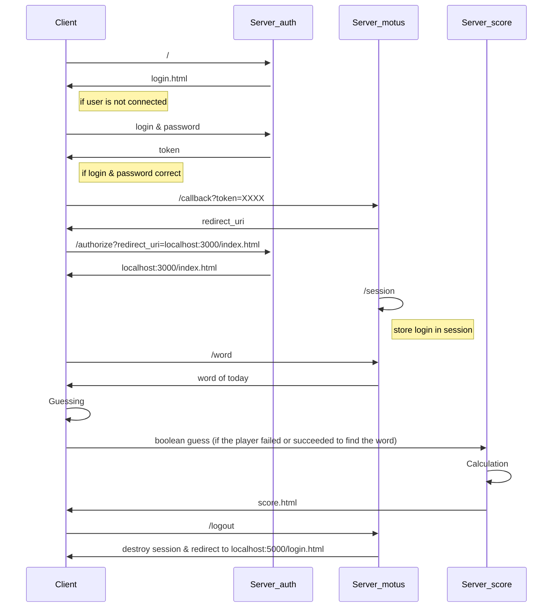

# MOTUS

### Victoria Wiecaszek
### Zaafira Abou Soufienne

## Comment exécuter :
```
docker-compose -f composeMotus.yml up
```
Puis aller sur http://localhost:5000
Entrer les identifiants suivants : 
    - pseudo : MikeOServiss
    - mot de passe : azerty


## Fonctonnalités implémentées :

- Si c'est le joueur n'est pas connecté, il doit entrer un pseudo et un mot de passe pour jouer. Un token lui est envoyé par le server *_auth* et renvoyé au server *_motus* si les identifiants sont corrects. Le serveur *_motus* redirige le joueur vers la page *localhost:3000/index.html* pour jouer.
- Le joueur doit deviner le mot du jour en entrant un mot dans la barre de réponse. Le nombre d'essai est limité à 10.
- Chaque essai est affiché dans un tableau avec les lettres trouvées dans la bonne place en vert, celles inclues dans le mot mais pas à la bonne place en orange, et le reste en bleu.
- Si le mot est bon, une pop-up affiche que le mot est correct.
- A chaque essai, un booléen est envoyé au server *_score* pour modifier ou non le score du joueur et stocker le nombre d'essai(s).
- En cliquant sur le lien *Score*, une page s'ouvre avec le score total du joueur ainsi que le nombre d'essai moyen.
- Le joueur peut se déconnecter en cliquant sur *Logout*. En se déconectant, les données de son score sont stockées dans des fichiers.

## Diagramme de séquence :



## A améliorer

- Nous n'avons qu'un seul joueur enregistré. Il faudrait regrouper les données de nos fichiers afin de pouvoir enregistrer plusieurs joueurs.
- Il n'y a pas de formulaire d'inscription pour créer un nouveau joueur.
- L'authentification n'est vérifiée qu'avec le serveur *_motus* ce qui fait qu'on peut accéder au server *_score* sans être connecté.
- Il s'agit d'une authentification simplifiée car il n'y a pas de communication entre les server *_motus* et *_auth* pour vérifier le token reçu.
- La partie monitoring n'a pas été implémentée


