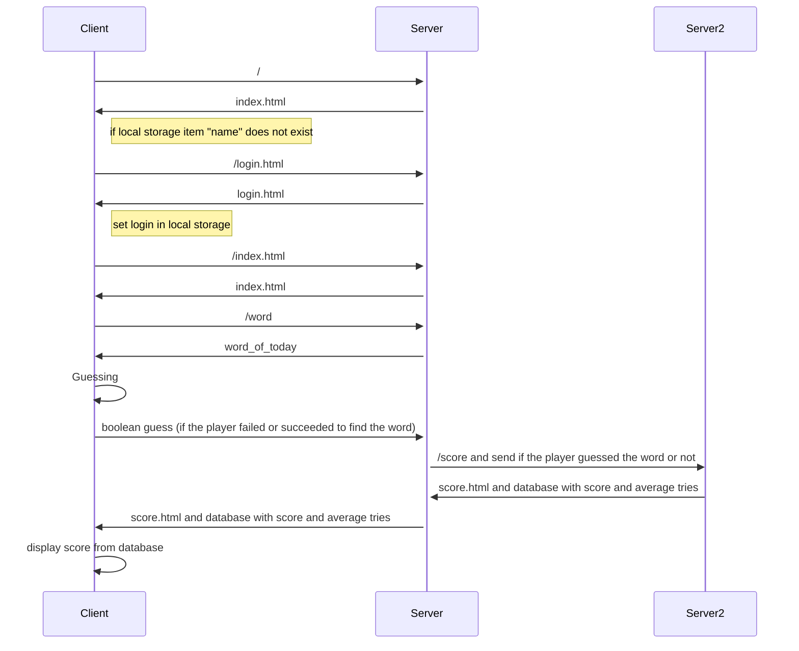

# MOTUS

### Victoria Wiecaszek
### Zaafira Abou Soufienne

## Comment exécuter :
```
npm install
node script.js
```
Puis aller sur http://localhost:3000


## Fonctonnalités implémentées :

- Si c'est un nouveau joueur, il doit entrer un pseudo (login) pour jouer. Pour retourner à la page principale, il faut cliquer sur le lien *Back to Motus*. Le pseudo y sera affiché.
- Le joueur doit deviner le mot du jour en dans la barre de réponse. Le nombre d'essai n'est pas limité.
- Si le mot n'est pas bon, une pop-up apparaît avec le message 'Le mot n'est pas bon'.
- Si le mot est bon, une pop-up affiche que le mot est correct.
- En cliquant sur le lien *Score*, une page s'ouvre avec le score total du joueur ainsi que le nombre d'essai moyen pour chaque mot

## Diagramme de séquence :



## API Score
- we use a second node server which uses the port 3001 
- we call the API /score which takes as parameter the result of the submit of the player (true or false)
- we do not have a database yet, so we cannot handle more than one user (we use local storage)
- we want to store : login, password, the scores and average number of tries of each player

